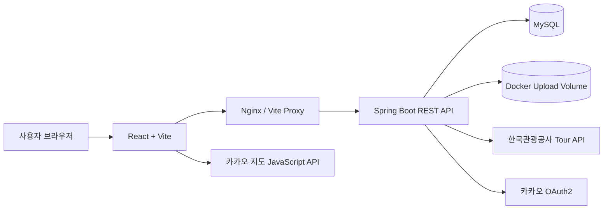
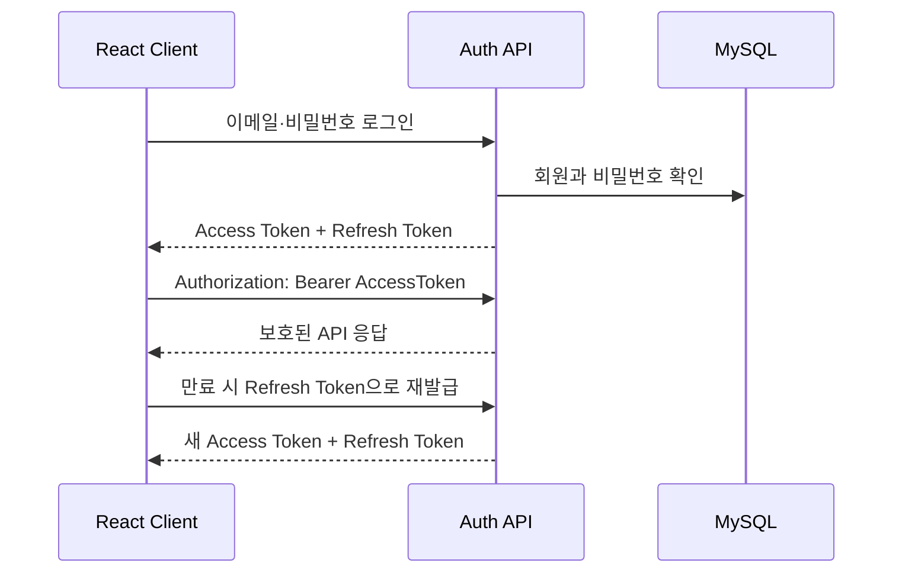

# 멍크크 Backend

> 반려견과 함께하는 장소 탐색, 산책 기록, 커뮤니티 활동을 하나로 연결한 모바일 웹 서비스의 백엔드입니다.

[](https://openjdk.org/)
[](https://spring.io/projects/spring-boot)
[](https://www.mysql.com/)
[](https://www.docker.com/)

## 프로젝트 소개

멍크크는 반려견 동반 가능 장소를 찾고, 산책을 기록하며, 다른 보호자와 정보를 나눌 수 있는 반려생활 플랫폼입니다. 백엔드는 회원 인증부터 장소·반려견·산책·그룹·커뮤니티 데이터를 관리하고 REST API로 프론트엔드에 제공합니다.

- Frontend: [meongkk/daenggo-FE](https://github.com/meongkk/daenggo-FE)
- Backend: [meongkk/daenggo-BE](https://github.com/meongkk/daenggo-BE)

## 주요 기능

| 영역 | 구현 내용 |
| --- | --- |
| 인증·회원 | 이메일 회원가입·로그인, JWT Access/Refresh Token, 토큰 재발급, 카카오 OAuth2 로그인, 로그아웃, 회원 탈퇴 |
| 프로필·반려견 | 내 정보 조회·수정, 비밀번호 변경, 프로필 이미지, 반려견 등록·수정·삭제, 대표 반려견 설정, 견종 조회 |
| 장소 | 한국관광공사 반려동물 동반여행 API 동기화, 주변·지역·키워드 검색, 반려견 조건 필터, 상세정보 조회 |
| 장소 정보 관리 | 즐겨찾기, 출입 조건 제보, 제보 승인·반려, 정책 변경 이력 관리 |
| 산책 | 산책 시작·완료, GPS 좌표 일괄 저장, 거리·시간 기록, 사진 업로드, 캘린더 및 경로 조회 |
| 그룹 | 그룹 생성·수정·삭제, 회원 초대·강퇴·탈퇴, 그룹장 위임, 그룹원 반려견·산책 기록 공유 |
| 커뮤니티 | 자유·장터·시터 게시판, 카테고리별 조회, 게시글·댓글 CRUD, 이미지 업로드, 작성자 권한 검증 |

## 팀원별 담당 역할

| 팀원 | 담당 영역 | 주요 구현 내용 |
| --- | --- | --- |
| 정민주 | 산책 | 산책 Entity·Controller·Service, 산책 시작·완료, GPS 경로, 거리·시간·페이스 계산, 사진, 캘린더·상세 기록, 삭제 처리 |
| 석종수 | 인증·회원·반려견·그룹 | JWT·Refresh Token, 이메일·카카오 로그인, 회원·프로필 이미지, 반려견 CRUD·대표견·견종, 그룹 CRUD·초대·권한 위임·기록 공유 |
| 김태중 | 장소·관광공사 API | 한국관광공사 API 연동·동기화, 장소·지역·주변 조회, 출입 조건 파싱, 반려견 맞춤 필터, 즐겨찾기·정보 신고·정책 변경 이력 |
| 전민규 | 커뮤니티·지도 UI·Docker | 게시글·댓글·이미지 Entity와 API, 카테고리별 조회, 작성자 전용 수정·삭제, 프론트 지도·검색·필터 UI, Docker Compose·Nginx 실행 환경 |

## 시스템 구조



## 기술 스택

- Java 21, Spring Boot 4.1
- Spring Web MVC, Spring Data JPA, Bean Validation
- Spring Security OAuth2 Client·Resource Server, JWT
- MySQL 8.4
- Springdoc OpenAPI·Swagger UI
- Maven, Lombok
- Docker Compose, Nginx
- 한국관광공사 Tour API, 카카오 OAuth2

## 프로젝트 구조

```text
src/main/java/com/daenggo/backend
├── auth       # 로그인, JWT, Refresh Token, 카카오 OAuth2
├── user       # 회원 정보와 회원 탈퇴
├── profile    # 회원·반려견 프로필 이미지
├── pet        # 반려견과 견종
├── place      # 동반 장소, 제보, 정책 이력, 외부 API 동기화
├── favorite   # 장소 즐겨찾기
├── walk       # 산책 기록, GPS 경로, 사진
├── group      # 그룹과 그룹원 관리
├── board      # 게시글, 댓글, 게시판 이미지
├── config     # 정적 파일 제공 설정
└── global     # Security, JWT, CORS, OpenAPI 공통 설정
```

## 실행 방법

### 1. Docker Compose로 전체 실행

프론트엔드와 백엔드 저장소를 같은 상위 폴더에 배치합니다.

```text
프로젝트/
├── daenggo-backend/
└── daenggo-FE/
```

백엔드 폴더에 `.env` 파일을 만듭니다.

```env
MYSQL_ROOT_PASSWORD=change-me
MYSQL_DATABASE=daenggo
MYSQL_USER=daenggo
MYSQL_PASSWORD=change-me

# 32바이트 이상의 문자열
JWT_SECRET=change-this-to-a-secret-key-at-least-32-bytes
JWT_ISSUER=daenggo-api

KAKAO_CLIENT_ID=
KAKAO_CLIENT_SECRET=
KAKAO_ADMIN_KEY=
KAKAO_REDIRECT_URI=http://localhost:8080/api/auth/oauth2/code/kakao

FRONTEND_ORIGIN=http://localhost:5173
OAUTH_LOGIN_SUCCESS_URL=http://localhost:5173/oauth/callback
OAUTH_SIGNUP_URL=http://localhost:5173/oauth/nickname
OAUTH_FAILURE_URL=http://localhost:5173/login

TOUR_API_BASE_URL=
TOUR_API_SERVICE_KEY=
```

다음 명령을 백엔드 폴더에서 실행합니다.

```powershell
docker compose up -d --build
```

| 서비스 | 주소 |
| --- | --- |
| Frontend | http://localhost:5173 |
| Backend API | http://localhost:8080 |
| Swagger UI | http://localhost:8080/swagger-ui/index.html |
| MySQL | localhost:3306 |

종료할 때는 다음 명령을 사용합니다.

```powershell
docker compose down
```

`docker compose down -v`는 DB와 업로드 볼륨까지 삭제할 수 있으므로 데이터 초기화가 목적일 때만 사용해야 합니다.

### 2. 백엔드만 로컬 실행

MySQL을 먼저 실행하고 `DB_URL`, `DB_USERNAME`, `DB_PASSWORD`, `JWT_SECRET` 환경변수를 설정합니다.

```powershell
cd C:\path\to\daenggo-backend
.\mvnw.cmd spring-boot:run
```

빌드와 테스트:

```powershell
.\mvnw.cmd test
.\mvnw.cmd clean package
```

## 주요 API

| 기능 | Method | Endpoint |
| --- | --- | --- |
| 회원가입 | `POST` | `/api/auth/signup` |
| 로그인 | `POST` | `/api/auth/login` |
| 토큰 재발급 | `POST` | `/api/auth/reissue` |
| 내 정보 | `GET/PATCH/DELETE` | `/api/users/me` |
| 반려견 | `GET/POST` | `/api/pets` |
| 반려견 상세 | `GET/PATCH/DELETE` | `/api/pets/{petId}` |
| 주변 장소 | `GET` | `/api/places/nearby` |
| 장소 검색 | `GET` | `/api/places/search` |
| 즐겨찾기 | `POST/DELETE` | `/api/places/{placeId}/favorites` |
| 산책 | `POST` | `/api/walks` |
| 산책 완료 | `PATCH` | `/api/walks/{walkId}/complete` |
| 그룹 | `GET/POST` | `/api/groups` |
| 게시글 | `GET/POST` | `/api/community/posts` |
| 게시글 상세 | `GET/PATCH/DELETE` | `/api/community/posts/{postId}` |
| 댓글 | `GET/POST` | `/api/community/posts/{postId}/comments` |
| 게시판 이미지 | `POST` | `/api/community/images` |

세부 요청·응답 형식은 실행 후 Swagger UI에서 확인할 수 있습니다.

## 인증 흐름



- Access Token은 요청의 `Authorization` 헤더로 전달합니다.
- Refresh Token은 DB에서 관리하며 재발급과 로그아웃에 사용합니다.
- 게시글·댓글·산책·그룹 등의 변경 API는 JWT 사용자와 데이터 소유자를 검증합니다.

## 이미지 저장 방식

이미지 파일 자체는 파일 시스템 또는 Docker 볼륨에 저장하고, DB에는 조회 가능한 URL을 저장합니다.

```text
이미지 업로드
→ 서버가 UUID 파일명으로 저장
→ 이미지 URL 생성
→ 게시글·회원·반려견·산책 데이터에 URL 저장
→ 조회 응답에서 URL 반환
```

Docker 환경에서는 `daenggo-community-uploads` 볼륨이 `/app/uploads`에 연결되어 컨테이너 재생성 후에도 파일을 유지합니다. DB 행을 삭제하는 것과 실제 파일을 삭제하는 것은 별도 작업이라는 점에 주의해야 합니다.

## 커뮤니티 카테고리

| 값 | 의미 | 추가 데이터 |
| --- | --- | --- |
| `FREE` | 자유 게시판 | 공통 게시글 정보 |
| `MARKET` | 장터 게시판 | 거래 종류, 가격 |
| `SITTER` | 시터·돌봄 게시판 | 돌봄 관련 정보 |

목록 API는 `/api/community/posts?category=FREE`처럼 `category` 쿼리 파라미터를 받아 해당 게시판의 글만 반환합니다.

## 개발 상태와 주의사항

- 현재 개발 단계의 프로젝트이며 운영 배포 전 보안·예외 처리·통합 테스트 보강이 필요합니다.
- 비밀키와 DB 비밀번호가 들어 있는 `.env` 파일은 Git에 커밋하지 않습니다.
- 외부 API 키는 발급 기관의 사용량 제한과 허용 도메인을 확인해야 합니다.
- Docker에서 Java 또는 React 코드를 변경했다면 해당 이미지를 다시 빌드해야 합니다.

## 관련 저장소

- [Frontend Repository](https://github.com/meongkk/daenggo-FE)
- [Backend Repository](https://github.com/meongkk/daenggo-BE)
